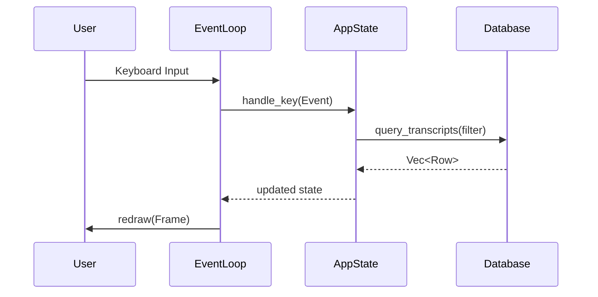

# Architecture & Implementation Details

This document provides a technical overview of the `transcript-explorer-rs` application.

## System Components

### 1. Database Layer (`src/db.rs`)
The application uses the `turso` crate, which is a pure Rust implementation of a SQLite-compatible database engine.
- **Async I/O**: All database operations are asynchronous, leveraging the `turso` crate's native async support.
- **Vector Search**: Leverages Turso's built-in `vector_distance_cos` function for high-performance similarity search directly in SQL.
- **Read-Only**: The application is designed to open the database in a read-only fashion to avoid file locks or corruption when browsing existing data.

### 2. Application State (`src/app.rs`)
The `App` struct acts as the central state machine.
- **Multi-View Navigation**: Manages transitions between `List`, `Detail`, and `Similar` views.
- **Pagination**: Implements a cursor-based pagination strategy, loading 100 rows at a time to maintain performance even with 10,000+ entries.
- **Filtered State**: Manages the live filter string and triggers database refreshes upon input changes.

### 3. UI Layer (`src/ui/`)
Built using `ratatui` with the `crossterm` backend.
- **Immediate Mode**: The UI is redrawn on every tick (250ms) or event, ensuring a responsive feel.
- **Custom Widgets**: Utilizes `List`, `Paragraph`, `Tabs`, and `Clear` widgets to build a multi-pane interface.
- **Layouts**: Uses constraint-based layouts to ensure the app scales properly across various terminal sizes.

## Data Flow

## Vector Search Implementation

The application performs semantic similarity search by querying the `embedding` column (BLOB) stored in the database.
1. The user selects a transcript.
2. The app fetches its embedding blob.
3. The app executes a SQL query that uses `vector_distance_cos` to find the top-20 nearest neighbors.
4. The results are displayed with similarity scores (calculated as `1.0 - distance`).
